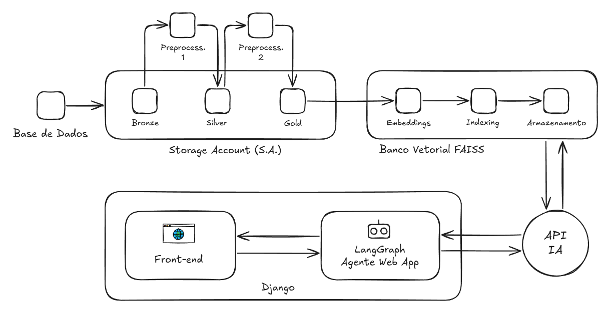

# Pergunta que Respondo

| Versão do Documento: | 1.2 |
| --- | --- |
| **Data:** | 26 de agosto de 2025 (atualizado em 23 set 2025)|
| **Autores:** | Felipe Toledo Neves (felipe.neves@iesb.edu.br)<br />​Gustavo Henrique Vicente Torres (gustavo.h.torres@iesb.edu.br) <br />Robson Ricardo Leite da Silva (robson.r.silva@iesb.edu.br) <br />​Victor Kauan Moreno de Brito (victor.brito@iesb.edu.br) |
| **Licença:** | GNU-3 (General Public License 3.0) |
| **Repositório:** | <https://github.com/jrsmoura/pergunta-que-respondo> |


## Resumo do Projeto

O "Pergunta que Respondo" é um assistente conversacional inteligente, desenvolvido em **Django** e orquestrado com **LangGraph**, que visa centralizar e facilitar o acesso a informações sobre educação na RIDE-DF. O sistema utiliza uma arquitetura de *Retrieval-Augmented Generation (RAG)*, onde um pipeline de dados processa notícias e documentos (arquitetura *Medallion*), transformando-os em uma base de conhecimento vetorial com **FAISS**. O agente inteligente consulta essa base para fornecer respostas fundamentadas e precisas às perguntas dos usuários. O projeto é gerenciado no **YouTrack**, documentado com **Sphinx** e tem suas dependências controladas pelo **Poetry**, visando as melhores práticas de desenvolvimento e manutenibilidade. A arquitetura de produção será implantada na **Google Cloud Platform (GCP)** e containerizada com **Docker**.


## Funcionalidades esperadas

1. **Interface de Chat:** Plataforma web interativa para que os usuários possam fazer perguntas em linguagem natural.
2. **Pipeline de Dados Automatizado:** Coleta e processamento de notícias seguindo o padrão Bronze (dados brutos), Silver (dados limpos) e Gold (dados agregados e prontos para uso).
3. **Busca Vetorial:** Utilização do FAISS para realizar buscas semânticas de alta velocidade na base de conhecimento, garantindo que o contexto mais relevante seja encontrado.
4. **Geração de Respostas Contextualizadas:** Uso de Modelos de Linguagem (LLMs) como o Gemini para gerar respostas fluidas e precisas, baseadas estritamente nas informações recuperadas.
5. **Orquestração com LangGraph:** Criação de um fluxo de execução robusto e cíclico para o agente de IA, permitindo um comportamento complexo e adaptativo.


## Arquitetura



O sistema é dividido em dois macro-componentes:

1. **Pipeline de Ingestão de Dados**
   * **Extração:** Fontes de notícias e documentos sobre educação na RIDE-DF são coletados.
   * **Processamento (Medallion):** Os dados brutos (camada **Bronze**) são limpos e estruturados (camada **Silver**) e, por fim, agregados e transformados para o consumo final (camada **Gold**).
   * **Vetorização:** O conteúdo da camada Gold é processado por um modelo de *embeddings* e armazenado em um índice vetorial **FAISS**, que serve como a memória de longo prazo do sistema.
2. **Aplicação Web e Agente Conversacional**
   * **Frontend:** Interface construída com HTML, CSS (Tailwind) e JavaScript, servida pelo Django.
   * **Backend (Django):** Gerencia as requisições, a lógica de negócios e a comunicação com o agente de IA.
   * **Agente de IA (LangGraph):** Recebe a pergunta do usuário, consulta a ferramenta de busca **Tavily** e o índice **FAISS** para recuperar o contexto relevante, e utiliza um LLM (**Gemini**) para sintetizar a resposta final.
   * **Containerização (Docker):** Toda a aplicação é encapsulada em um container Docker, facilitando o deploy e garantindo a consistência entre os ambientes de desenvolvimento e produção.

     

## Tecnologias Utilizadas

| Categoria | Ferramenta/Tecnologia | Descrição |
| --- | --- | --- |
| **Backend** | Django, Python | Framework web para a construção da aplicação da API. |
| **Orquestração de LLMs** | LangGraph | Biblioteca para construir agentes de IA robustos e com estado. |
| **Frontend** | HTML, CSS (Tailwind) | Tecnologias para a interface do usuário e API de alta performance com Django. |
| **Banco de Dados Vetorial** | FAISS | Biblioteca para busca de similaridade eficiente em vetores de alta dimensão. |
| **Busca e IA Generativa** | Tavily, Gemini | Ferramenta de busca otimizada para LLMs e modelo de linguagem generativa. |
| **DevOps e Ferramentas** | Docker, Poetry, Sphinx, YouTrack, GitHub | Conteinerização, gerenciamento de dependências, documentação, gerenciamento de projetos e controle de versão. |


## Observações técnicas

* O gerenciamento das tarefas e do backlog do projeto é realizado através do **YouTrack (JetBrains)**.
* A documentação técnica detalhada do código-fonte é gerada automaticamente pelo **Sphinx**.
* O ambiente de produção alvo para esta aplicação é o **Google Cloud Platform (GCP)**.

  

## Observações gerais

* **Escopo do Conhecimento:** O conhecimento do chatbot é estritamente limitado ao conteúdo das notícias que foram coletadas e processadas. Ele não possui informações sobre outros assuntos ou eventos que não estejam em sua base de dados.
* **Atualização dos Dados:** A base de conhecimento não é atualizada em tempo real. Existe uma defasagem entre a publicação de uma notícia e sua incorporação ao índice do chatbot, dependente da frequência de execução do pipeline de coleta.
* **Ambiente de Desenvolvimento vs. Produção:** O ambiente de desenvolvimento local foi projetado para ser simples e autocontido, utilizando um arquivo de índice FAISS local. O ambiente de produção na GCP poderá utilizar soluções mais robustas para a base vetorial, como o Vertex AI Vector Search, para maior escalabilidade e performance.
* **Segurança e Privacidade:** O chatbot não deve solicitar, processar ou armazenar informações de identificação pessoal dos usuários. Todas as interações devem ser anônimas.

  

## Configuração do Ambiente

Para configurar o ambiente de desenvolvimento local, siga os passos abaixo.

#### Pré-requisitos

* **Git**
* **Python < 3.12**
* **Poetry**
* **Docker** e **Docker Compose**

  
#### Passos para Instalação

1. **Clonar o Repositório:**

   ```
   git clone https://github.com/jrsmoura/pergunta-que-respondo
   cd pergunta-que-respondo
   ```

2. **Configurar Variáveis de Ambiente:** Copie o arquivo de exemplo `.env.example` para um novo arquivo chamado `.env` e preencha as variáveis necessárias, como as chaves de API para o Tavily, Gemini, etc..

   ```
   # .env
   GEMINI_API_KEY="SUA_CHAVE_API_AQUI"
   TAVILY_API_KEY="SUA_CHAVE_API_AQUI"
   # Outras variáveis de ambiente...
   ```

3. **Instalar Dependências:** O Poetry irá ler o arquivo `pyproject.toml` e instalar todas as dependências do projeto em um ambiente virtual isolado.

   ```
   poetry install
   ```

4. **Execução (local):** 

   - Rode o crawler para coletar notícias e atualizar o banco FAISS. Isso vai buscar novas notícias, salvar na pasta ```data/bronze``` e atualizar ```FAISS/```.

      ```
      poetry run python crawler/crawler_exec.py
      ```

   - Suba o servidor Django:

      ```
      poetry run python web/manage.py runserver
      ```

5. **Construir e Iniciar os Contêineres:** O Docker Compose irá construir as imagens e iniciar os serviços definidos no arquivo `docker-compose.yml`.

   ```
   docker-compose up --build
   ```

   A aplicação estará disponível em <http://localhost:8000> (ou na porta configurada no `docker-compose.yml`).

   

## Cronograma

O projeto será desenvolvido em sprints quinzenais, iniciando a partir do dia 12 de agosto de 2025, com previsão de término em 07 de outubro de 2025.